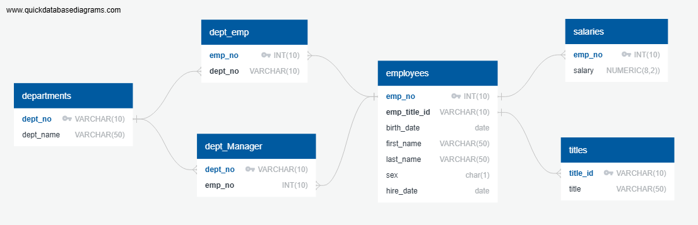
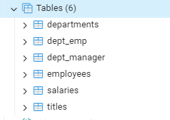
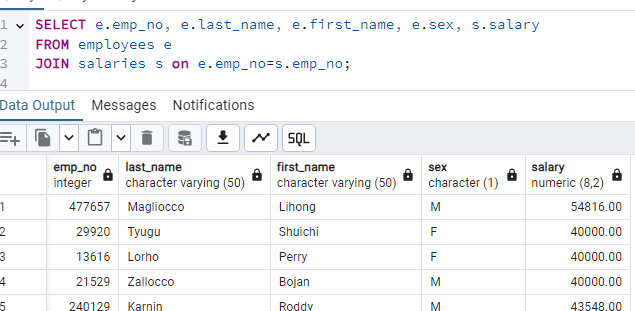
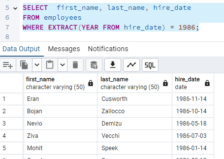
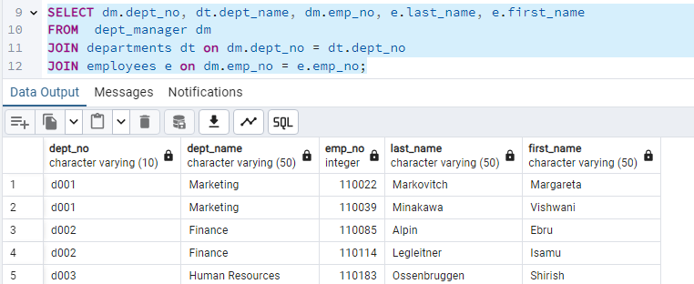
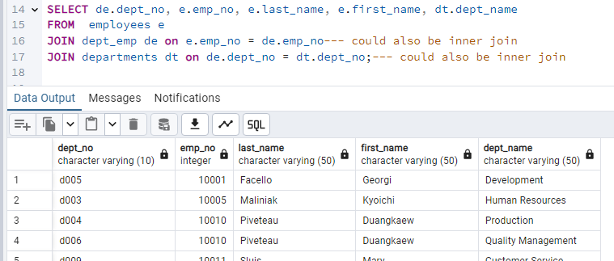
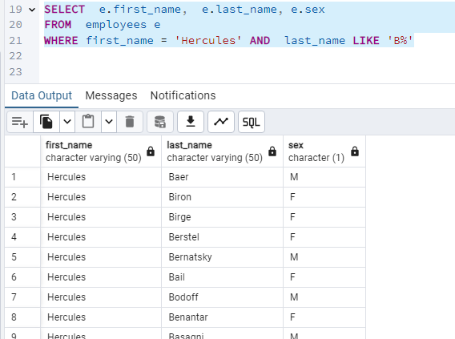
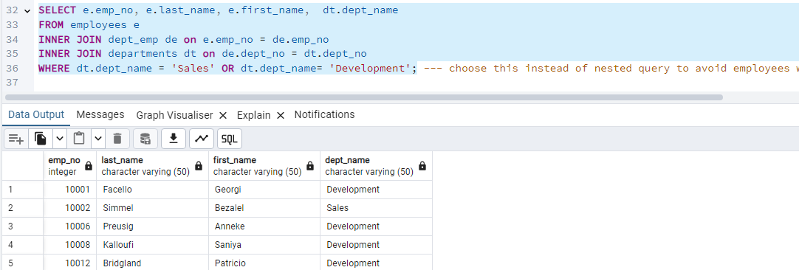
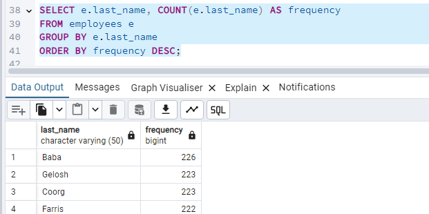

# SQL-CHALLENGE
---
---
## This project will illustrate SQL database techniques.

### Data Modeling

  - QuickDBD-export file is an Entity Relationship Diagram.

---
### Data Engineering

- data_engineering.sql file has the table schema for the six CSV files in data folder.

---
### Data Analysis
All the queries are in data_Analysis.sql.

- List of each employee number, last name, first name, sex, and salary in the employees.csv file

- List of first name, last name, and hire date for the employees who were hired in 1986, from information in the data folder.

- List of the manager of each department along with their department number, department name, employee number, last name, and first name, from information in the data folder.

- List of the department number for each employee along with that employee’s employee number, last name, first name, and department name, from information in the data folder.

- List of first name, last name, and sex of each employee whose first name is Hercules and whose last name begins with the letter B, from information in the data folder.

- List of each employee in the Sales department, including their employee number, last name, and first name, from information in the data folder.

- List of each employee in the Sales and Development departments, including their employee number, last name, first name, and department name, from information in the data folder.

- List of frequency counts, in descending order, of all the employee last names, from information in the data folder.

